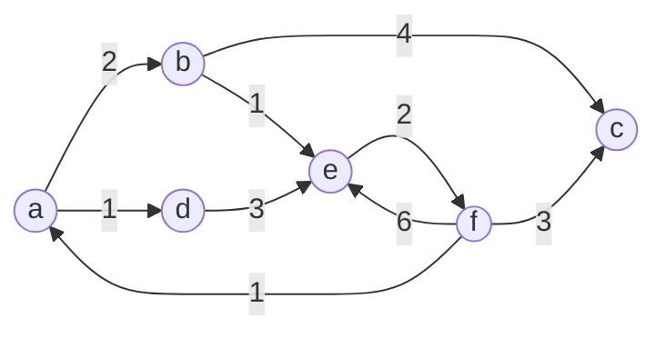

# UniC

A comprehensive general-purpose C library providing essential data structures, algorithms, and utility functions for C development.

## 🚀 Features

- **Data Structures**: Matrices, Vectors, Linked Lists, Trees, Hash Maps, Graphs, and more
- **Algorithms**: Optimized search and sorting implementations
- **Libft**: Extended standard library functions
- **Cross-platform**: Compatible with modern C compilers
- **Well-documented**: Comprehensive documentation for all functions

## 📋 Requirements

### Core Dependencies

- **gcc** - GNU Compiler Collection
- **make** - Build automation tool  
- **cmake** (≥ 3.10.0) - Cross-platform build system

### Documentation (Optional)

- **python** - For documentation generation
- **go** - Backend API server
- **node.js** - Frontend documentation UI
- **postgresql** - Documentation database

## ⚡ Quick Start

### Installation

```bash
# Clone and build the library
mkdir build && cd build
cmake ..
sudo make install
```

### Basic Usage

```c
#include <unic/datastructures.h>
#include <unic/algorithms.h>

int main() {
    // Your code here
    return 0;
}
```

### CMake Integration

```cmake
cmake_minimum_required(VERSION 3.10.0)
project(your_project)

find_library(UNIC_LIBRARY
    NAMES unic.so
    PATHS /usr/local/lib
    REQUIRED)

add_executable(main main.c)
target_include_directories(main PRIVATE /usr/local/include)
target_link_libraries(main PRIVATE ${UNIC_LIBRARY} m)
```

## 📚 Documentation

### Inline Documentation

All functions include comprehensive inline documentation with usage examples.

### Interactive Documentation UI

For an enhanced documentation experience:

```bash
# Setup documentation environment
./doc_uisetup.sh

# Launch documentation server
./doc_uistart.sh
```

> **Note**: The documentation UI is experimental and includes heavy dependencies. For production use, refer to inline documentation.

## 📦 Library Contents

### Data Structures

| Structure | Description |
|-----------|-------------|
| **Matrices** | Dynamic matrix operations |
| **Vectors** | Resizable array implementation |
| **Linked Lists** | Single and double linked lists |
| **Queues & Stacks** | FIFO and LIFO structures |
| **Binary Trees** | Tree traversal and operations |
| **Hash Maps** | Key-value dictionary implementation |
| **Heaps** | Priority queue structures |
| **Graphs** | Graph representation and algorithms |

### Algorithms

- **Search**: Binary search, linear search variants
- **Sort**: Quick sort, merge sort, heap sort implementations

### Utility Functions (libft)

Extended C standard library with additional string manipulation, memory management, and utility functions.

## 🛠 Examples

### Graph Visualization

Generate visual representations using [Mermaid](https://github.com/mermaid-js/mermaid):

```bash
make graphdraw
```

**Output:**



## 📝 Version History

### Version 2.1 - Latest

- ✅ Documentation generation system
- ✅ Interactive documentation UI  
- ✅ Code style improvements (42 Norminette compliance)
- ✅ Major refactor: headers organized in `unic/` directory
- ✅ Library renamed to `unic` for consistency

### Breaking Changes

- Headers moved to `unic/` folder - update your includes
- Library name changed from previous versions - update linking

## 📄 License

This project is licensed under the GNU General Public License v3.0 - see the [LICENSE](LICENSE) file for details.

## 🤝 Contributing

Contributions are welcome! Please feel free to submit issues and enhancement requests.

---

**UniC** - Empowering C development with robust, efficient data structures and algorithms.
