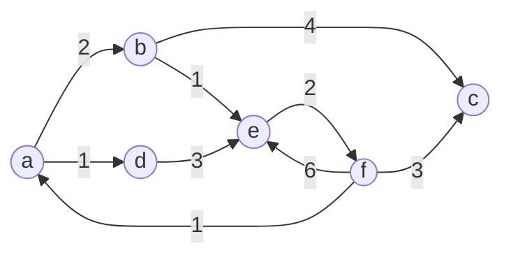

# UniC

## Update info

- major refactor
- headers moved into "unic" folder

### Version
2.1

### Latest features & changes

- doc generation
- doc ui
- 42 norminette (almost)

## About

General purpose library

### Dependecies

- gcc
- make
- doc (optional)
	- python
	- node
	- postgresql

### Doc
Documentation is provided on top of every function

If you want to use the client for a better experience, check the dependencies

```sh
# build postgres db and next-js
bash ./doc_uisetup.sh
or
chmod 777 ./doc_uisetup.sh && ./doc_uisetup.sh
```

#### Run UI

```sh
bash ./doc_uistart.sh
or
chmod 777 ./doc_uistart.sh && ./doc_uistart.sh
```

### Linking

```sh
# go inside UniC path
cd <lib path>
# compile library
make
# link library
gcc ... <lib path>/UniC.a
```

## Content

### Datastructures

- Matrices
- Vector
- Node
- Linked list
- Double linked list
- Queue
- Stack
- Binary tree
- Dictionary (Hash map)
- Heap
- Graph

### Algorithms

- Search
- Sort

### Libft

Basic implementation

## Examples

Compile the library before running any example

### Graph

- Generate a graphical representation of the graph using [mermaid](https://github.com/mermaid-js/mermaid)

```make
make graphdraw
```

output:


